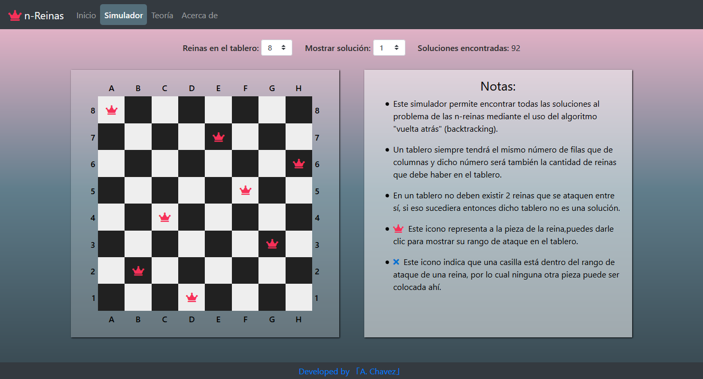

# n-Queens problem – web application
## Description
This application was built for the web and its purpose is to show all possible solutions for the n-queens problem for a specific size of board.

The n-queens problem consists on the following, let’s suppose that we have a board of an ‘n’ quantity of  columns and  an ‘n’ quantity of rows, in other words, a square board, and we only are allowed to place an ‘n’ quantity of queen pieces, the only constraint that we have is that no two queen pieces can attack each other. The main issue with this problem is that the queen is the strongest piece on this game and its range of attack is really wide, so the goal is to find all possible permutations in which we can place all ‘n’ queen pieces on the board without forgetting the main constraint.

This application finds all possible solutions for the n-queens problem using a backtracking algorithm.
## Technologies used:
* Spring Boot
* Java
* Thymeleaf
* HTML
* CSS
* JavaScript
* Bootstrap
* jQuery
## Screenshot
